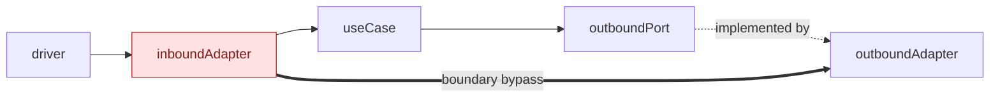

# Hexagonal Mermaid graph

Derive the diagram from source evidence. Treat directory names and architecture
documentation as hints.

## Inspect the code

1. Read the repository guidance and establish the requested source scope.
2. Inventory production packages or modules and their source imports.
3. Find interface, protocol, abstract class, and callback declarations.
4. Find constructors and composition roots that connect interfaces to concrete
   implementations.
5. Inspect handlers, commands, consumers, schedulers, and workers to find entry
   points.
6. Inspect SQL, network, filesystem, message-broker, and external-client usage
   to find infrastructure dependencies.
7. Use tests to confirm method sets and boundary enforcement. Exclude test-only
   relationships from the production graph.

Useful searches include:

```sh
rg --files <scope>
rg -n '^(import|from|export .* from)' <scope>
rg -n 'interface|Protocol|ABC|abstract class' <scope>
rg -n 'New[A-Z]|Build|Create|Provide|Inject|Register' <scope>
rg -n 'database/sql|sql\.DB|net/http|requests|fetch|filesystem|kafka|s3' <scope>
```

For Go packages, derive exact import edges with a disposable cache when needed:

```sh
GOCACHE=/tmp/hexagonal-graph-go-cache \
  go list -f '{{.ImportPath}}|{{join .Imports ","}}' ./...
```

Delete disposable analysis files and caches after recording the findings.

## Classify each element

- **Driver**: actor or event that starts an operation, such as an HTTP client,
  command invocation, queue message, process lifecycle event, or timer.
- **Inbound adapter**: validates and translates driver input, invokes a use
  case, and presents the result.
- **Use case**: framework-free application behavior expressed in domain terms.
- **Inbound port**: domain-owned operation through which an adapter invokes a
  use case.
- **Outbound port**: narrow interface owned by the use case that needs an
  external capability.
- **Outbound adapter**: concrete database, network, storage, broker, or service
  implementation of an outbound port.
- **Composition root**: code that constructs implementations and wires them to
  consumers.

Verify structural interface implementations from method sets and wiring.
Interface names alone do not prove a port-to-adapter relationship.

Treat small interfaces around SQL methods inside an adapter as adapter-local
test seams unless domain or application code consumes them.

## Find offenders

Mark a package, type, or path as an offender when source evidence shows one of
these conditions:

- An inbound adapter imports a concrete repository or executes SQL directly.
- A use case imports an HTTP framework, database API, external client,
  filesystem, logger, telemetry library, or application configuration.
- An inbound port is declared by the adapter instead of the use case that
  offers the operation.
- A use-case package also contains concrete database, network, filesystem, or
  storage adapters.
- A driver or inbound adapter calls an outbound adapter without a use-case and
  outbound-port boundary.
- Adapter construction occurs outside the composition root.

State the exact reason in the red node label. A clean type that shares a package
with infrastructure is a package-boundary offender; do not claim its behavior
is infrastructure-coupled when only its location is at fault.

Record missing architecture tests as an enforcement gap. Do not present the
absence of a test as a dependency violation.

## Draw one focused graph

Default to this left-to-right flow:

`drivers → inbound adapters → use cases → outbound ports → outbound adapters`

Keep inbound ports as labels on adapter-to-use-case arrows. Keep outbound ports
as nodes between use cases and implementations. Use dashed arrows to map ports
to implementations.

Use red nodes to list offenders. Use red, thick arrows for paths that bypass a
use-case or outbound-port boundary. Group closely related ports in one node
when listing each interface would obscure the structure.

Do not add a separate raw import graph unless the user requests it. Import
direction and operation flow express different relationships. Use imports as
evidence for classification, then state which relationship the displayed
arrows represent.

Use this structure with source-backed names:



Add subgraphs for each category. Use distinct styles for drivers, ports, use cases, adapters, and
offenders. Recount `linkStyle` indexes after changing edges.

## Report the assessment

Follow the graph with one explicit conclusion: aligns, partially aligns, or
does not align with hexagonal design.

Support the conclusion with a compact table:

| Area | Assessment |
| --- | --- |
| Domain and use cases | State whether they remain framework-free. |
| Inbound adapters | State whether they call use cases through inbound ports. |
| Outbound ports | State whether consumers own narrow interfaces. |
| Outbound adapters | State whether implementations depend inward. |
| Composition | State whether wiring stays in a composition root. |
| Enforcement | Name architecture tests and coverage gaps. |

Name concrete packages, types, and interfaces. Separate confirmed violations
from improvement proposals.

## Verify the artifact

- Compare every node and edge with imports, declarations, method sets, and
  composition wiring.
- Confirm each red offender has a concrete source reason.
- Run `git diff --check` for a repository document.
- Render Mermaid when a local renderer already exists.
- Follow repository-specific documentation verification.
- Do not refactor the code unless the user requests implementation changes.
