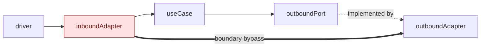

# Hexagonal Mermaid graph

Derive the diagram from source evidence. Treat directory names and architecture
documentation as hints. To implement changes, use the `hexagonal-architecture`
skill instead.

## Inspection

1. Read the repository guidance and establish the source scope.
2. Inventory production packages and their imports.
3. Find interface, protocol, abstract class, and callback declarations.
4. Find constructors and composition roots that connect interfaces to
   implementations.
5. Inspect handlers, commands, consumers, schedulers, and workers for entry
   points.
6. Inspect SQL, network, filesystem, broker, and external-client usage for
   infrastructure dependencies.
7. Use tests to confirm method sets and boundary enforcement. Exclude test-only
   relationships from the graph.

```sh
rg --files <scope>
rg -n '^(import|from|export .* from)' <scope>
rg -n 'interface|Protocol|ABC|abstract class' <scope>
rg -n 'New[A-Z]|Build|Create|Provide|Inject|Register' <scope>
rg -n 'database/sql|sql\.DB|net/http|requests|fetch|filesystem|kafka|s3' <scope>
```

For Go, derive exact import edges with a disposable cache:

```sh
GOCACHE=/tmp/hexagonal-graph-go-cache \
  go list -f '{{.ImportPath}}|{{join .Imports ","}}' ./...
```

Delete disposable files and caches after you record the findings.

## Classification

- **Driver**: actor or event that starts an operation. An HTTP client, a command
  invocation, a queue message, a lifecycle event, or a timer.
- **Inbound adapter**: validates driver input, invokes a use case, presents the
  result.
- **Inbound port**: domain-owned operation through which an adapter invokes a
  use case.
- **Use case**: framework-free application behavior in domain terms.
- **Outbound port**: narrow interface owned by the use case that needs a
  capability.
- **Outbound adapter**: database, network, storage, broker, or service
  implementation of an outbound port.
- **Composition root**: code that constructs implementations and wires them to
  consumers.

Confirm each port-to-adapter relationship from method sets and wiring. Interface
names are not proof.

A small interface around SQL methods inside an adapter is an adapter-local test
seam, unless domain or application code consumes it.

## Offenders

Mark a package, type, or path as an offender only on source evidence.

- An inbound adapter imports a concrete repository or runs SQL.
- A use case imports an HTTP framework, database API, external client,
  filesystem, logger, telemetry library, or configuration.
- An inbound port is declared by the adapter instead of the use case.
- A use-case package also holds concrete adapters.
- A driver or inbound adapter calls an outbound adapter directly.
- Adapter construction occurs outside the composition root.

State the exact reason in the red node label. A clean type that shares a package
with infrastructure is a package-boundary offender. Do not claim its behavior is
infrastructure-coupled when only its location is at fault.

A missing architecture test is an enforcement gap, not a dependency violation.

## Graph

Default to `drivers → inbound adapters → use cases → outbound ports → outbound
adapters`.

Keep inbound ports as labels on adapter-to-use-case arrows. Keep outbound ports
as nodes. Use dashed arrows from a port to its implementation. Use red nodes for
offenders and red thick arrows for boundary bypasses. Group related ports in one
node when a node for each interface obscures the structure.



Add a subgraph for each category. Style drivers, ports, use cases, adapters, and
offenders differently. Recount `linkStyle` indexes after you change an edge.

Do not add a raw import graph unless the user asks. Imports and operation flow
are different relationships: use imports as evidence, then state which
relationship the arrows show.

## Assessment

State one conclusion: aligns, partially aligns, or does not align. Support it
with this table, and name concrete packages, types, and interfaces.

| Area | Assessment |
| --- | --- |
| Domain and use cases | Whether they remain framework-free. |
| Inbound adapters | Whether they call use cases through inbound ports. |
| Outbound ports | Whether consumers own narrow interfaces. |
| Outbound adapters | Whether implementations depend inward. |
| Composition | Whether wiring stays in a composition root. |
| Enforcement | Architecture tests and coverage gaps. |

Separate confirmed violations from improvement proposals.

## Verification

- Compare every node and edge with imports, declarations, method sets, and
  wiring.
- Confirm each red offender has a source reason.
- Run `git diff --check` for a repository document.
- Render Mermaid when a local renderer exists.
- Do not refactor the code unless the user asks.
